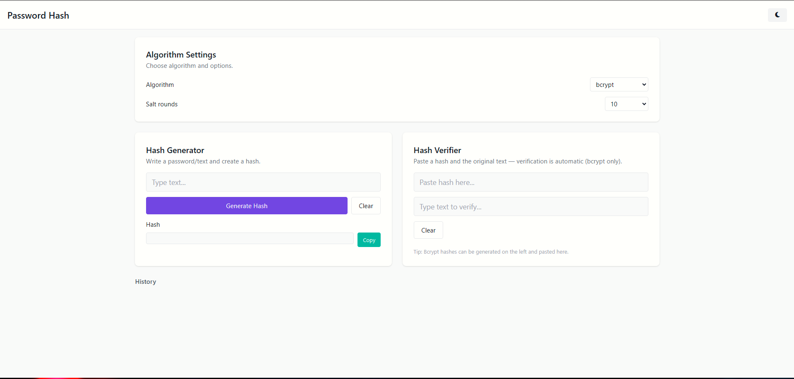
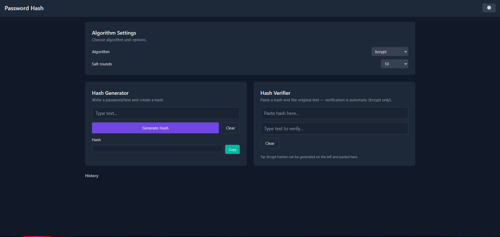

# 🔐 Hash Playground — Tailwind

A simple **frontend-only** playground for experimenting with different hashing algorithms. Built with **HTML, JavaScript, and Tailwind CSS**, featuring **Dark/Light mode**, hash generation, and verification.



---

## ✨ Features

* 🔑 **Hash Generator**: Supports `bcrypt`, `SHA-256`, `MD5`, and `Base64`.
* ✅ **Hash Verifier**: Verify text against generated hashes (bcrypt compare + recompute for others).
* 🎛️ **Salt Rounds Selector**: Adjustable for bcrypt (4–15).
* 📋 **Copy to Clipboard** button for generated hashes.
* 🧹 **Clear Inputs** quickly.
* ⚡ **Auto Verify**: Live verification while typing.
* 🌓 **Dark/Light Mode** (with local storage persistence).
* 🕑 **History Log** of generated hashes with reuse and delete options.
* 📱 **Responsive Design** for mobile & desktop.

---

## 🚀 Getting Started

Clone the repository and open `index.html` in your browser:

```bash
git clone https://github.com/your-username/hash-playground.git
cd hash-playground
```

Then open:

```bash
index.html
```

No backend or build tools required — it’s **100% client-side**.

---

## 📦 CDN Libraries Used

* [Tailwind CSS](https://tailwindcss.com/)
* [bcrypt.js](https://github.com/dcodeIO/bcrypt.js)
* [blueimp-md5](https://github.com/blueimp/JavaScript-MD5)

---

## 📸 Screenshots




---

## ⚠️ Disclaimer

This project is for **educational and testing purposes only**. Do **not** use it in production for sensitive password handling.

---

## 🤝 Contributing

Pull requests and feature suggestions are welcome! 🙌

1. Fork the repo
2. Create your feature branch: `git checkout -b feature-name`
3. Commit your changes: `git commit -m 'Add feature'`
4. Push to the branch: `git push origin feature-name`
5. Open a pull request

---

## 📜 License

MIT License © 2025 — Made with ❤️ by \[Your Name]
